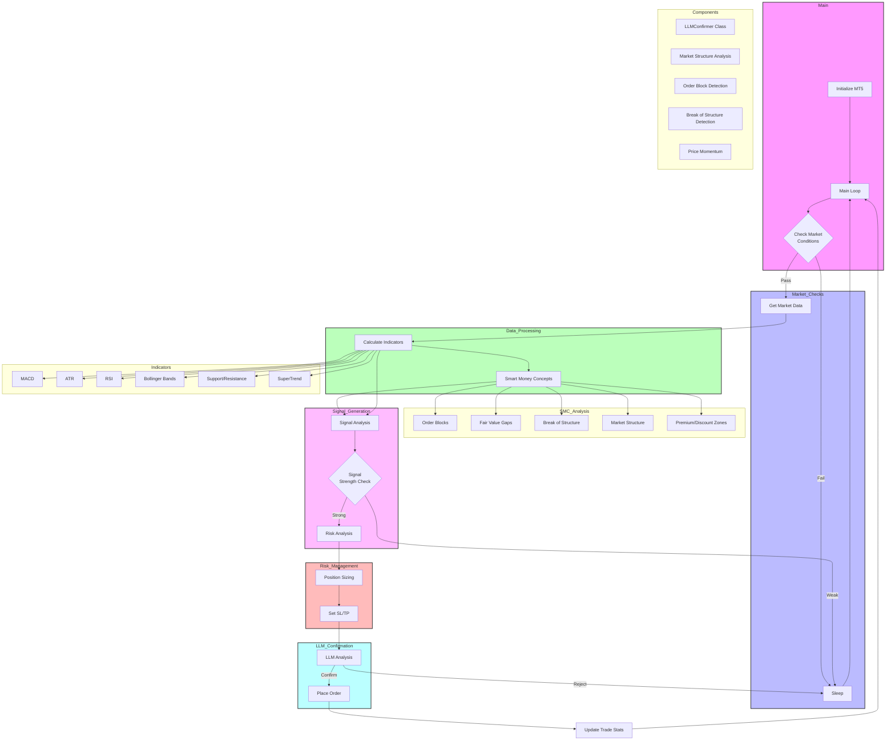

```mermaid
graph TB
    subgraph Main
        A[Initialize MT5] --> B[Main Loop]
        B --> C{Check Market<br/>Conditions}
    end

    subgraph Market_Checks
        C -->|Pass| D[Get Market Data]
        C -->|Fail| E[Sleep]
        E --> B
    end

    subgraph Data_Processing
        D --> F[Calculate Indicators]
        F --> G[Smart Money Concepts]
    end

    subgraph Indicators
        F --> F1[MACD]
        F --> F2[ATR]
        F --> F3[RSI]
        F --> F4[Bollinger Bands]
        F --> F5[Support/Resistance]
        F --> F6[SuperTrend]
    end

    subgraph SMC_Analysis
        G --> G1[Order Blocks]
        G --> G2[Fair Value Gaps]
        G --> G3[Break of Structure]
        G --> G4[Market Structure]
        G --> G5[Premium/Discount Zones]
    end

    subgraph Signal_Generation
        H[Signal Analysis] --> I{Signal<br/>Strength Check}
        I -->|Strong| J[Risk Analysis]
        I -->|Weak| E
    end

    subgraph Risk_Management
        J --> K[Position Sizing]
        K --> L[Set SL/TP]
    end

    subgraph LLM_Confirmation
        L --> M[LLM Analysis]
        M -->|Confirm| N[Place Order]
        M -->|Reject| E
    end

    G --> H
    F --> H
    N --> O[Update Trade Stats]
    O --> B

    subgraph Components
        P[LLMConfirmer Class]
        Q[Market Structure Analysis]
        R[Order Block Detection]
        S[Break of Structure Detection]
        T[Price Momentum]
    end

    style Main fill:#f9f,stroke:#333,stroke-width:2px
    style Market_Checks fill:#bbf,stroke:#333,stroke-width:2px
    style Data_Processing fill:#bfb,stroke:#333,stroke-width:2px
    style Signal_Generation fill:#fbf,stroke:#333,stroke-width:2px
    style Risk_Management fill:#fbb,stroke:#333,stroke-width:2px
    style LLM_Confirmation fill:#bff,stroke:#333,stroke-width:2px
```
